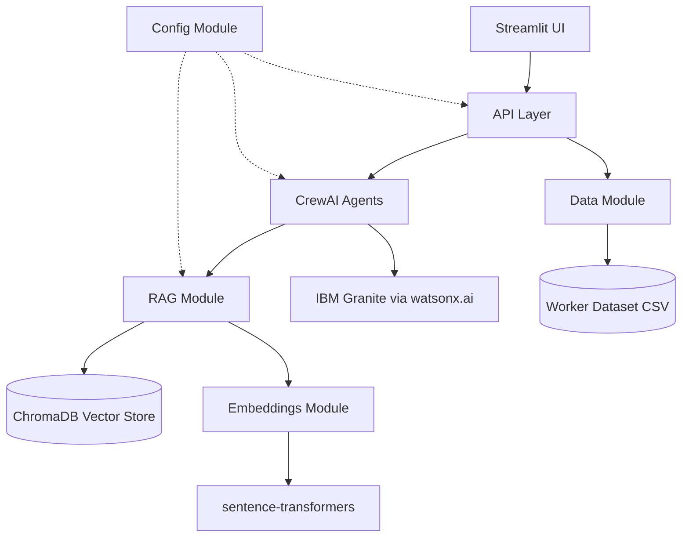
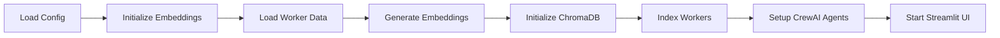
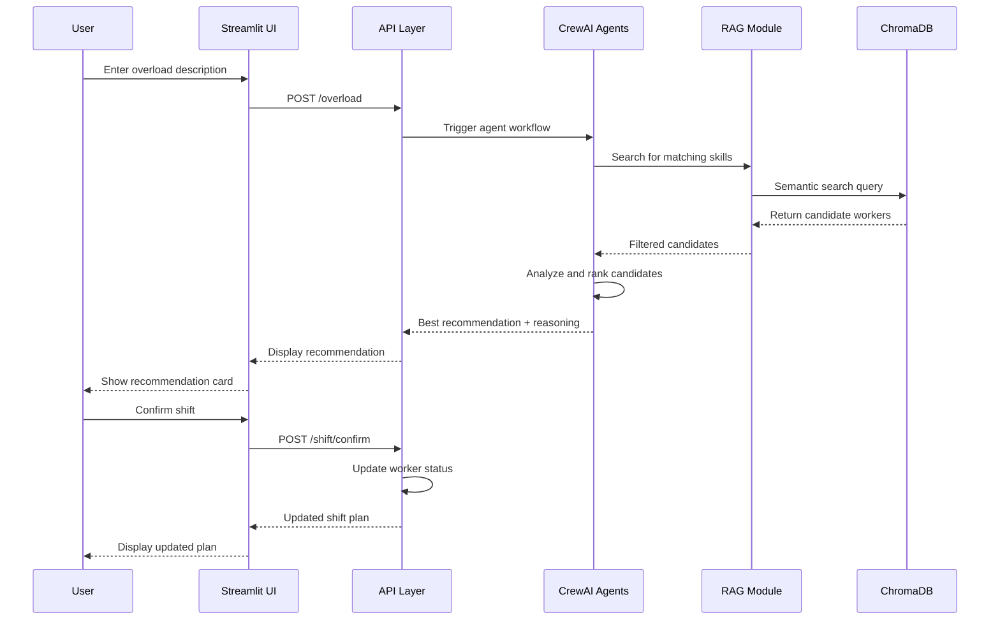

# SmartShift Implementation Plan
## AI Warehouse Workforce Optimizer - IBM Dev Day Bob Hackathon

---

## 1. System Architecture Overview



---

## 2. Component Specifications

### 2.1 Configuration Module (`config/`)

**Files:**
- `config/settings.py` - Central configuration management
- `config/.env.example` - Environment variable template

**Responsibilities:**
- Load environment variables for watsonx.ai credentials
- Manage ChromaDB settings (persistence directory, collection name)
- Configure embedding model parameters
- Set logging levels and output formats

**Key Configuration Items:**
```python
WATSONX_API_KEY
WATSONX_PROJECT_ID
WATSONX_URL
CHROMA_PERSIST_DIR = "./chroma_db"
CHROMA_COLLECTION_NAME = "worker_skills"
EMBEDDING_MODEL = "all-MiniLM-L6-v2"
LLM_MODEL = "ibm/granite-13b-chat-v2"
```

---

### 2.2 Data Module (`data/`)

**Files:**
- `data/workers.csv` - Worker dataset (25-30 workers)
- `data/loader.py` - CSV loading and validation utilities
- `data/models.py` - Pydantic models for data validation

**Worker Data Schema:**
```csv
worker_id,name,primary_skill,transferable_skills,current_zone,shift,load_status,available
W001,Ahmed Hassan,Forklift Operator,"Packing,Loading,Heavy Equipment",Zone B,Morning,Low,Yes
```

**Worker Zones:**
- Zone A: Receiving
- Zone B: Packing
- Zone C: Dispatch
- Zone D: Storage

**Shift Timings:**
- Morning: 6AM - 2PM
- Afternoon: 2PM - 10PM
- Night: 10PM - 6AM

**Load Status:**
- Low: 0-40%
- Medium: 41-70%
- High: 71-100%

**Sample Skills:**
- Forklift Operator
- Packing Specialist
- Quality Inspector
- Loading Bay Operator
- Inventory Manager
- Heavy Equipment Operator
- Order Picker
- Shipping Coordinator

---

### 2.3 Embeddings Module (`embeddings/`)

**Files:**
- `embeddings/skill_embedder.py` - Skill vectorization using sentence-transformers
- `embeddings/utils.py` - Embedding utilities and helpers

**Responsibilities:**
- Initialize sentence-transformers model (all-MiniLM-L6-v2)
- Generate embeddings for worker skills (primary + transferable)
- Batch processing for efficient embedding generation
- Cache embeddings to avoid recomputation

**Key Functions:**
```python
def initialize_model() -> SentenceTransformer
def embed_skills(skills: List[str]) -> List[List[float]]
def embed_worker_profile(worker: Worker) -> Dict[str, Any]
```

---

### 2.4 RAG Module (`rag/`)

**Files:**
- `rag/vector_store.py` - ChromaDB initialization and management
- `rag/retriever.py` - Semantic search and retrieval logic
- `rag/query_builder.py` - Query construction utilities

**Responsibilities:**
- Initialize ChromaDB with persistent storage
- Create and manage "worker_skills" collection
- Index worker profiles with skill embeddings
- Perform semantic search for skill matching
- Filter results by zone, availability, shift timing

**Key Functions:**
```python
def initialize_chroma_db() -> chromadb.Client
def index_workers(workers: List[Worker]) -> None
def search_workers_by_skill(skill: str, filters: Dict) -> List[Worker]
def get_available_workers(exclude_zone: str) -> List[Worker]
```

**Search Filters:**
- Exclude current zone (not already in overloaded zone)
- Availability status (must be "Yes")
- Shift timing (must match or overlap)
- Load status (prefer Low or Medium)

---

### 2.5 CrewAI Agents Module (`agents/`)

**Files:**
- `agents/skill_matcher.py` - Skill Matcher Agent
- `agents/shift_planner.py` - Shift Planner Agent
- `agents/crew_setup.py` - CrewAI configuration and orchestration
- `agents/tools.py` - Custom tools for agents

**Agent 1: Skill Matcher Agent**
- **Role:** Skill Search Specialist
- **Goal:** Find workers with matching or transferable skills
- **Backstory:** Expert at understanding skill relationships and worker capabilities
- **Tools:**
  - `search_workers_tool` - Query ChromaDB for skill matches
  - `get_worker_details_tool` - Retrieve full worker profile
- **Output:** List of 2-5 candidate workers with match scores

**Agent 2: Shift Planner Agent**
- **Role:** Workforce Optimization Strategist
- **Goal:** Select the best worker to shift and explain the decision
- **Backstory:** Experienced in balancing workload and minimizing disruption
- **Tools:**
  - `calculate_load_impact_tool` - Estimate load rebalancing
  - `check_zone_capacity_tool` - Verify zone can spare worker
- **Output:** Single recommendation with detailed reasoning

**CrewAI Configuration:**
```python
crew = Crew(
    agents=[skill_matcher_agent, shift_planner_agent],
    tasks=[skill_matching_task, shift_planning_task],
    process=Process.sequential,
    verbose=True
)
```

**LLM Integration:**
```python
from langchain_ibm import WatsonxLLM

llm = WatsonxLLM(
    model_id="ibm/granite-13b-chat-v2",
    url=WATSONX_URL,
    apikey=WATSONX_API_KEY,
    project_id=WATSONX_PROJECT_ID,
    params={
        "max_new_tokens": 500,
        "temperature": 0.7,
        "top_p": 0.9
    }
)
```

---

### 2.6 API Layer (`api/`)

**Files:**
- `api/routes.py` - API endpoint definitions
- `api/schemas.py` - Request/response models
- `api/service.py` - Business logic layer

**Endpoints:**

1. **GET /workers**
   - Returns all workers with current status
   - Response: List of worker profiles

2. **POST /overload**
   - Input: Overload description (natural language)
   - Process: Parse input, trigger agent workflow
   - Response: Shift recommendations with reasoning

3. **GET /workers/{worker_id}**
   - Returns specific worker details
   - Response: Single worker profile

4. **POST /shift/confirm**
   - Input: Confirmed shift change
   - Process: Update worker zones and load status
   - Response: Updated shift plan

**Request/Response Models:**
```python
class OverloadRequest(BaseModel):
    description: str  # "Zone A forklift station is overloaded"
    
class ShiftRecommendation(BaseModel):
    worker_id: str
    worker_name: str
    from_zone: str
    to_zone: str
    skill_match: str
    reasoning: str
    load_impact: Dict[str, float]
```

---

### 2.7 Streamlit Frontend (`frontend/`)

**Files:**
- `frontend/app.py` - Main Streamlit application
- `frontend/components/worker_registry.py` - Worker table display
- `frontend/components/overload_input.py` - Input form
- `frontend/components/recommendation_card.py` - Recommendation display
- `frontend/components/shift_plan.py` - Updated shift visualization
- `frontend/styles.py` - Custom CSS styling

**UI Layout:**

```
┌─────────────────────────────────────────────────┐
│  SmartShift - AI Workforce Optimizer            │
├─────────────────────────────────────────────────┤
│  📊 Current Worker Registry                     │
│  ┌───────────────────────────────────────────┐  │
│  │ Table: ID | Name | Skill | Zone | Load   │  │
│  └───────────────────────────────────────────┘  │
├─────────────────────────────────────────────────┤
│  🚨 Report Overload Situation                   │
│  ┌───────────────────────────────────────────┐  │
│  │ Text Input: "Zone A dispatch overloaded"  │  │
│  │ [Get Recommendation] Button               │  │
│  └───────────────────────────────────────────┘  │
├─────────────────────────────────────────────────┤
│  💡 AI Recommendation                           │
│  ┌───────────────────────────────────────────┐  │
│  │ Worker: Ahmed Hassan (W001)              │  │
│  │ Move: Zone B → Zone A                    │  │
│  │ Skill: Forklift (transferable)           │  │
│  │ Reasoning: Zone B at 40% load, can spare │  │
│  │ [Confirm Shift] Button                   │  │
│  └───────────────────────────────────────────┘  │
├─────────────────────────────────────────────────┤
│  📋 Updated Shift Plan                          │
│  ┌───────────────────────────────────────────┐  │
│  │ Before/After comparison table             │  │
│  │ Load rebalancing metrics                  │  │
│  │ [Export CSV] Button                       │  │
│  └───────────────────────────────────────────┘  │
└─────────────────────────────────────────────────┘
```

**Key Features:**
- Real-time worker status updates
- Natural language input processing
- Visual load indicators (color-coded)
- Expandable recommendation reasoning
- CSV export functionality
- Responsive design for demo presentation

---

### 2.8 Main Application (`main.py`)

**Responsibilities:**
- Initialize all modules (config, embeddings, RAG, agents)
- Load worker dataset and create embeddings
- Index workers in ChromaDB
- Start Streamlit frontend
- Handle graceful shutdown

**Initialization Flow:**


---

## 3. Data Flow Diagram



---

## 4. Implementation Phases

### Phase 1: Foundation (Core Infrastructure)
- Set up project configuration and environment
- Create worker dataset CSV
- Implement configuration module
- Set up logging and error handling

### Phase 2: Data & Embeddings Layer
- Build data loading utilities
- Implement embeddings module with sentence-transformers
- Create ChromaDB integration
- Index sample worker data

### Phase 3: RAG & Search
- Implement semantic search functionality
- Add filtering logic (zone, availability, shift)
- Create query builder utilities
- Test retrieval accuracy

### Phase 4: AI Agents
- Set up watsonx.ai LLM connection
- Implement Skill Matcher Agent
- Implement Shift Planner Agent
- Create custom tools for agents
- Test agent workflow end-to-end

### Phase 5: API Layer
- Define API endpoints and schemas
- Implement business logic
- Add request validation
- Test API responses

### Phase 6: Frontend
- Build Streamlit UI components
- Implement worker registry display
- Create overload input form
- Add recommendation visualization
- Implement shift plan updates

### Phase 7: Integration & Testing
- Connect all components
- End-to-end testing
- Performance optimization
- Error handling refinement

### Phase 8: Documentation & Demo
- Write comprehensive README
- Create setup instructions
- Prepare demo scenarios
- Record demo video

---

## 5. Technical Dependencies

```
# Core Framework
python>=3.10
streamlit>=1.28.0
crewai>=0.28.0
langchain-ibm>=0.1.0

# Vector Database & Embeddings
chromadb>=0.4.18
sentence-transformers>=2.2.2

# Data Processing
pandas>=2.0.0
pydantic>=2.0.0

# IBM watsonx.ai
ibm-watsonx-ai>=0.2.0
ibm-watson-machine-learning>=1.0.0

# Utilities
python-dotenv>=1.0.0
requests>=2.31.0
```

---

## 6. Environment Variables (.env.example)

```bash
# IBM watsonx.ai Configuration
WATSONX_API_KEY=your_api_key_here
WATSONX_PROJECT_ID=your_project_id_here
WATSONX_URL=https://us-south.ml.cloud.ibm.com

# ChromaDB Configuration
CHROMA_PERSIST_DIR=./chroma_db
CHROMA_COLLECTION_NAME=worker_skills

# Embedding Model
EMBEDDING_MODEL=all-MiniLM-L6-v2

# LLM Configuration
LLM_MODEL=ibm/granite-13b-chat-v2
LLM_MAX_TOKENS=500
LLM_TEMPERATURE=0.7

# Application Settings
LOG_LEVEL=INFO
DEBUG_MODE=False
```

---

## 7. Success Metrics for Demo

1. **Functional Completeness**
   - All 5 core features working end-to-end
   - Natural language input correctly parsed
   - Accurate skill matching (>80% relevance)
   - Clear recommendation reasoning

2. **Performance**
   - Search response time < 3 seconds
   - Agent reasoning time < 5 seconds
   - UI responsive and smooth

3. **User Experience**
   - Intuitive UI navigation
   - Clear visual feedback
   - Understandable AI explanations
   - Professional presentation quality

4. **Technical Quality**
   - Clean, documented code
   - Proper error handling
   - Modular architecture
   - Easy setup process

---

## 8. Demo Script (3 minutes)

**Minute 1: Problem & Solution Overview**
- Show warehouse staffing challenge
- Introduce SmartShift AI solution
- Quick architecture overview

**Minute 2: Live Demo**
- Display current worker registry
- Enter overload scenario: "Zone A dispatch needs forklift help"
- Show AI recommendation with reasoning
- Confirm shift and display updated plan

**Minute 3: Technical Highlights**
- IBM Granite LLM reasoning
- Semantic skill matching with ChromaDB
- CrewAI agent collaboration
- Built entirely with IBM Bob IDE

---

## 9. File Structure Summary

```
smartshift/
├── .env.example
├── .gitignore
├── requirements.txt
├── README.md
├── IMPLEMENTATION_PLAN.md
├── main.py
├── config/
│   ├── __init__.py
│   └── settings.py
├── data/
│   ├── __init__.py
│   ├── workers.csv
│   ├── loader.py
│   └── models.py
├── embeddings/
│   ├── __init__.py
│   ├── skill_embedder.py
│   └── utils.py
├── rag/
│   ├── __init__.py
│   ├── vector_store.py
│   ├── retriever.py
│   └── query_builder.py
├── agents/
│   ├── __init__.py
│   ├── skill_matcher.py
│   ├── shift_planner.py
│   ├── crew_setup.py
│   └── tools.py
├── api/
│   ├── __init__.py
│   ├── routes.py
│   ├── schemas.py
│   └── service.py
├── frontend/
│   ├── app.py
│   ├── components/
│   │   ├── __init__.py
│   │   ├── worker_registry.py
│   │   ├── overload_input.py
│   │   ├── recommendation_card.py
│   │   └── shift_plan.py
│   └── styles.py
└── tests/
    ├── __init__.py
    ├── test_embeddings.py
    ├── test_rag.py
    ├── test_agents.py
    └── test_api.py
```

---

## 10. Next Steps

1. Review and approve this implementation plan
2. Switch to Code mode to begin implementation
3. Start with Phase 1 (Foundation)
4. Iterate through phases sequentially
5. Test each component before moving to next phase
6. Prepare demo materials and video

---

**Plan Status:** Ready for Review
**Estimated Implementation Time:** 6-8 hours (with Bob assistance)
**Target Demo Date:** May 3, 2026